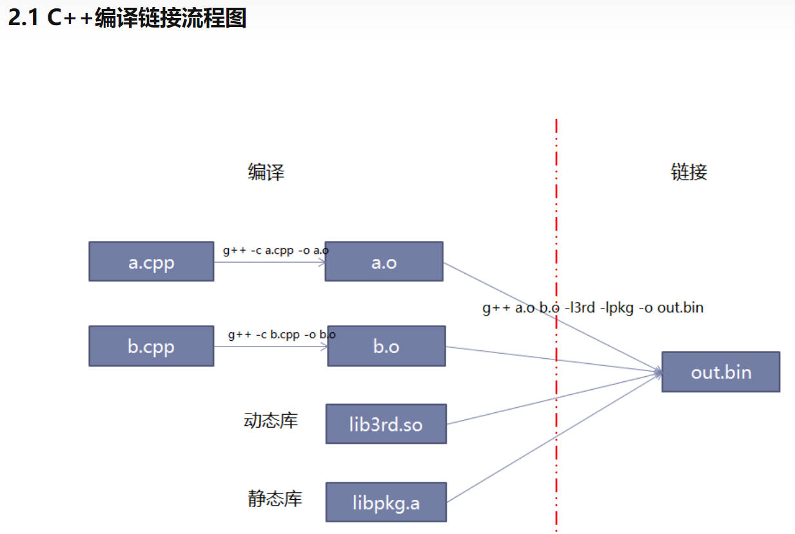

# 第一个cpp程序
- 这里我们使用g++进行编译、链接，并运行起来
- 只做基本的打印

# 如何跑起来
视频讲解地址:
1. 单文件编译helloworld.mp4
2. 多文件编译helloworld.mp4

在终端输入
`g++ main.cpp`

# 关于 g++
- g++和gcc都是gnu推出的cpp编译器，时代不同
- g++和gcc都可以进行cpp编译
- g++和gcc一样，都属于driver，即驱动编译，他会调用cclplus/ccl/ld/as等指令实现编译链接等工作，他们俩只-是默认选项上的处理不同
- 这里我们采用g++而不是gcc
- g++ 等价于 gcc -xc++ -lstdc++ -shared-libgcc
    参考：https://www.zhihu.com/question/2094
    
[详细可参考](https://zhuanlan.zhihu.com/p/396448133#:~:text=1.1-,g%2B%2B/gcc%E6%98%AF%E4%BB%80%E4%B9%88%EF%BC%8C%E6%9C%89%E4%BB%80%E4%B9%88%E5%8C%BA%E5%88%AB,-g%2B%2B%E5%92%8Cgcc)

# 关于编译与链接
- 编译，代码编译到二进制：g++ -c main.cpp -o main.o
- 链接，多个二进制链接成执行程序：g++ main.o -o main.bin

    

[详细可参考](https://zhuanlan.zhihu.com/p/396448133#:~:text=2.%20C%2B%2B%E7%BC%96%E8%AF%91%E9%93%BE%E6%8E%A5%20/%20%E7%BC%96%E8%AF%91%E6%97%B6%E5%92%8C%E8%BF%90%E8%A1%8C%E6%97%B6)

    